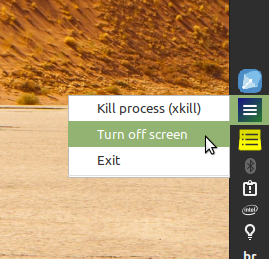

# my-tray-menu

Delivers a simple to setup-up tray menu.



## Dead simple configuration

Sample my-tray-meny.yaml:

```
Turn off screen: /bin/sh ./scripts/turn-off-screen.sh
Kill process (xkill): xkill
Exit: killall my-tray-menu
```

## Requirements

- Go 1.9

## Dependencies' set-up

Follow instructions for specific OS dependencies at:

https://github.com/getlantern/systray

## Usage

```
go get https://github.com/evandrojr/my-tray-menu
my-tray-menu
```

Manual:

```
git clone git@github.com:evandrojr/my-tray-menu.git
cd my-tray-menu
go get
go build
./my-tray-menu
```

🍻

## References:

1. https://github.com/Osuka42g/simple-clock-systray
1. https://github.com/getlantern/systray
