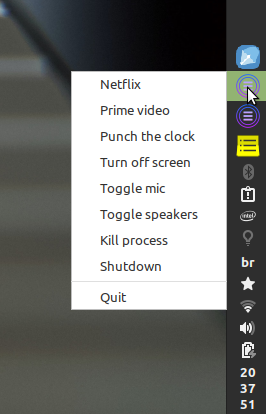

# my-tray-menu

Delivers an easy set up tray menu.



[demo.webm](https://user-images.githubusercontent.com/939608/183258199-f92279f0-3a65-4c05-910b-db7bea126766.webm)

## Dead simple configuration

Sample my-tray-meny.yaml:

```
Netflix: google-chrome https://netflix.com
Prime video: google-chrome https://www.primevideo.com/
Separator: Separator
Punch the clock: google-chrome https://xxxxxxx.xxxxxx.xxxxxx/
Separator: Separator
Turn off screen: /bin/sh /home/j/lab/my-tray-menu/scripts/turn-off-screen.sh
Toggle mic: /bin/sh /home/j/lab/my-tray-menu/scripts/toggle-microphone.sh
Toggle speakers: pactl set-sink-mute @DEFAULT_SINK@ toggle
Kill process: xkill
Separator: Separator
Shutdown: sudo shutdown -P now
```

## Requirements

- Go 1.9

## Dependencies' set up

Follow instructions for specific OS dependencies at:

https://github.com/getlantern/systray

## Usage

```
go get https://github.com/evandrojr/my-tray-menu
my-tray-menu
```

Manual:

```
git clone git@github.com:evandrojr/my-tray-menu.git
cd my-tray-menu
go get
go build
./my-tray-menu
```

## Known bug:

1. Icon is not showing in Windows, Linux is ok, never tested in Mac;
1. Does not accept spaces in the path like "Program files\chrome.exe";

🍻

## References:

1. https://stackoverflow.com/questions/73261794/unable-to-loop-through-golang-dynamic-channels
1. https://github.com/Osuka42g/simple-clock-systray
1. https://github.com/getlantern/systray
